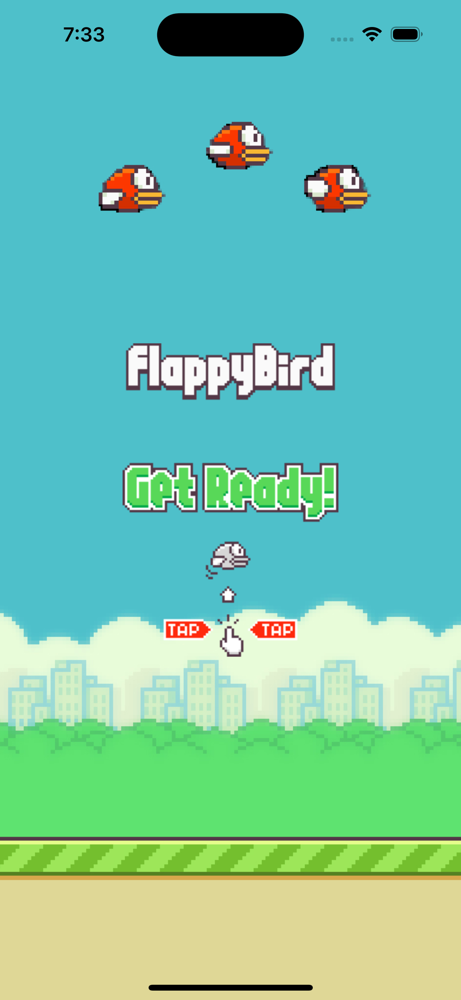
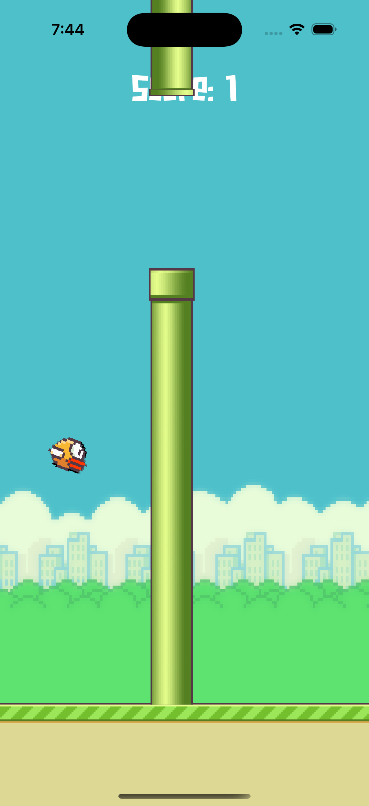
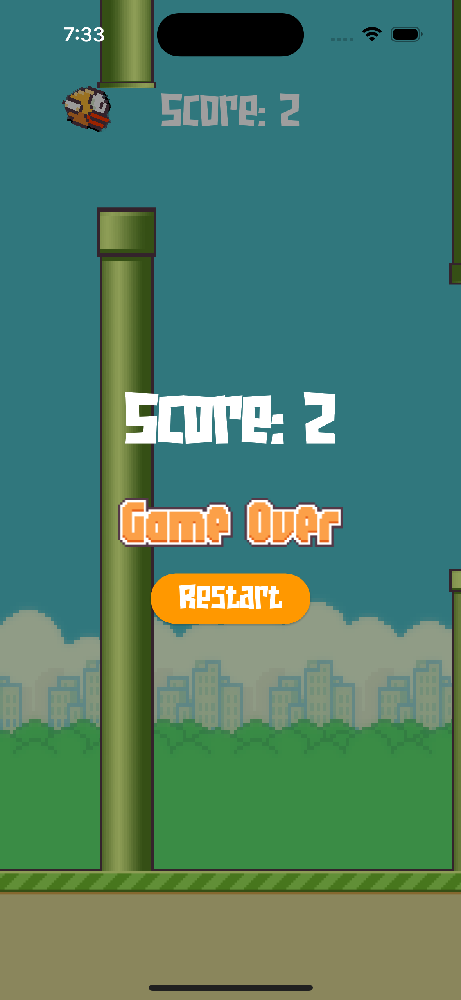

# Flappy Bird - A Flutter Flame Game

Welcome to **Flappy Bird**, my first-ever game built using Flutter and the [Flame game engine](https://flame-engine.org/). This is a simple recreation of the classic Flappy Bird, where the player controls a bird and navigates through obstacles by tapping the screen.

## 🎮 Game Screenshots

Here are a few screenshots of the game in action:

  
  
  

## 📚 What I Learned

Developing this game taught me a lot about both Flutter and game development in general. Some key takeaways include:

- **Game Loops:** Understanding the fundamental game loop (update and render cycles) and how they drive the game.
- **Physics and Collisions:** Implementing basic physics for gravity and collision detection between the bird and the obstacles.
- **State Management:** Managing game states like *playing*, *paused*, and *game over* using Flame's built-in utilities.
- **Asset Management:** Loading and handling assets like sprites, sounds, and fonts efficiently.
- **Flame Integration:** How to integrate the Flame engine with Flutter and leverage Flame components to build a game quickly.
- **Flame Audio:** Utilizing Flame's audio features to add sound effects like flapping wings, background music, and game-over sounds. I learned how to load and control audio assets using `FlameAudio.play()`, manage volume levels, and trigger sounds based on in-game events, which added a lot of depth to the game experience.

